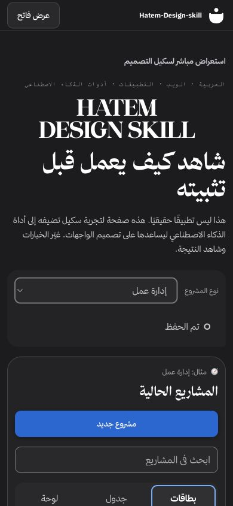
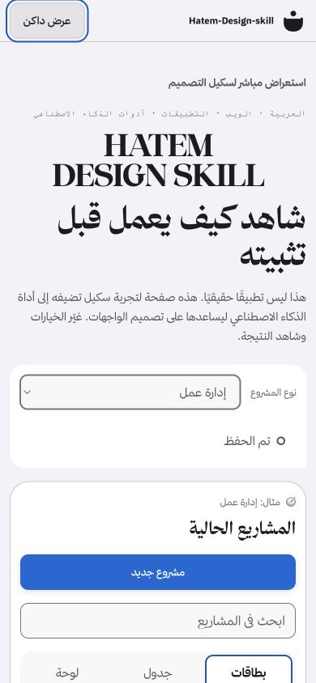

<div dir="rtl">

# ضاد — Dhad

ضاد يجعل المنتج يبدو عربيًا ويتصرّف بالعربية. يجمع في سكيل واحد نظام تصميم يبدأ من RTL وطبقة صحّة تضبط الجمع والترتيب والبحث والأرقام والتقويم الهجري للويب وSaaS والجوال وسطح المكتب.

بدل قلب الواجهة إلى اليمين فقط، يراجع ضاد النص والبيانات والحالات والتفاعل، ثم يكيّفها مع هوية منتجك من دون فرض قالب بصري ثابت.

[المعاينة الحية](https://dhad.iiammar.com) · [English](README.en.md) · [الترخيص](LICENSE)

<p align="center">
  
  &nbsp;&nbsp;
  
</p>

## ما الذي يقدمه؟

- واجهات عربية RTL مع جزر LTR للروابط والأكواد والأرقام.
- وضعان داكن وفاتح بتوكنز دلالية قابلة لإعادة الاستخدام.
- مكوّنات وحالات للويب، مع بدايات للمنصات الأصلية.
- لغة وإيموجي تتكيّف مع هوية المشروع بدل فرض قالب ثابت.
- قواعد واضحة للوصول، الجوال، الحفظ، الخطأ وعدم الاتصال.

## التثبيت

المصدر واحد ويُجهّز في حزمتين:

| الحزمة | تعمل مع | الاستدعاء |
|---|---|---|
| `Dhad-openai-plugin.zip` | ChatGPT وCodex | `@dhad` أو `$dhad` |
| `Dhad-agent-skill.zip` | Claude Chat وClaude Code | تلقائيًا بعد التفعيل أو `/dhad` |

لبناء الحزمتين من المصدر:

```bash
python3 scripts/build_releases.py
```

ولتثبيت السكيل مباشرة في Codex:

```text
$skill-installer ثبّت dhad من https://github.com/iiAMMAR11/Dhad
```

مثال للاستدعاء:

```text
$dhad صمّم واجهة عربية RTL لهذا المشروع وكيّف مكوّناتها مع هويته
```

## الخطوط

Dhad يضمّن خط IBM Plex Sans Arabic بأوزانه الثمانية تحت رخصة OFL-1.1. يعمل الخط محليًا ومن دون CDN داخل الـstarter وحزم التثبيت.

[IBM Plex Sans Arabic](https://github.com/IBM/plex)

## مفتوح للجميع

ضاد مشروع مفتوح المصدر تحت [رخصة MIT](LICENSE)، ويمكن استخدامه وتعديله وبناء منتجات عامة أو خاصة عليه. تفاصيل حقوق المصادر والخطوط في [NOTICE](NOTICE.md)، والمساهمات مرحّب بها وفق [دليل المساهمة](CONTRIBUTING.md).

تعتمد طبقة الصحّة على معايير [Unicode CLDR/ICU](https://cldr.unicode.org)، ويأتي خط IBM Plex Sans Arabic مضمّنًا تحت OFL-1.1.

## التواصل

تطوير وصيانة ضاد: عمَّار. تواصل معي إذا كان عندك تعديل أو فكرة أو مشروع يستخدم السكيل.

[GitHub](https://github.com/iiAMMAR11) · [X](https://x.com/iiAMMAR11) · [Hello@iiammar.com](mailto:Hello@iiammar.com) · [iiammar.com](https://iiammar.com)

</div>
